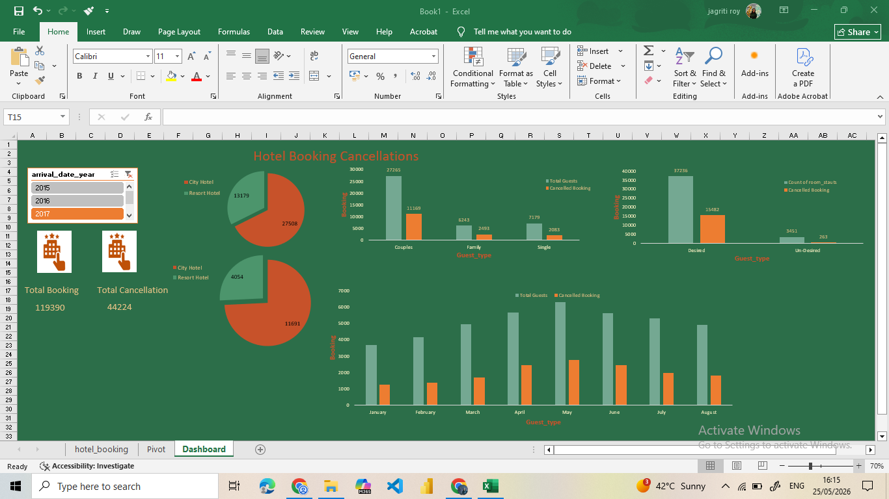

🏨 Hotel Booking Cancellation Analysis

📌 Project Overview
Hotel booking cancellations can significantly affect hotel revenue and operational planning. This project focuses on analyzing hotel booking data using Microsoft Excel to identify patterns and factors that influence booking cancellations.
The analysis helps understand customer behavior and provides insights that can assist hotel management in reducing cancellation rates and improving decision-making.

🎯 Objectives
Analyze hotel booking cancellation trends.
Identify factors affecting booking cancellations.
Generate meaningful insights from hotel booking data.
Visualize booking patterns using charts and reports.
Support better hotel management decisions.

🛠️ Tools Used
Microsoft Excel
Excel Functions & Formulas
Pivot Tables
Charts and Graphs
Data Filtering and Sorting

📊 Dataset Information
The dataset contains hotel booking information, including:
Booking Status
Lead Time
Number of Adults
Number of Children
Meal Type
Market Segment
Customer Type
Previous Cancellations
Special Requests
Reservation Details
The data is analyzed to identify booking behaviors and cancellation patterns.

📈 Analysis Performed
Data Cleaning
Removed duplicate records
Handled missing values
Organized data for analysis
Data Visualization
Cancellation Rate Analysis
Customer Type Analysis
Market Segment Analysis
Booking Trend Analysis
Reservation Pattern Analysis
Reporting
Pivot Tables
Summary Reports
Interactive Charts

📁 Project Structure
Hotel-Booking-Cancellation/
│
├── Book1 (1).xlsx      # Dataset used for analysis
├── Pivot.png           # Pivot table analysis screenshot
├── dashboard.png       # Dashboard visualization
└── README.md           # Project documentation
📊 Key Insights
Identified major factors responsible for booking cancellations.
Analyzed customer booking behavior.
Compared cancellation rates across different booking categories.
Generated visual reports for easier interpretation.

📷 Screenshots

🔮 Future Improvements
Build an interactive dashboard using Power BI.
Apply machine learning models for prediction.
Integrate real-time hotel booking data.
Develop a web-based analytics system.

👩‍💻 Author
Jagriti Roy
GitHub: https://github.com/jagritiroy3

⭐ If you find this project useful, feel free to star the repository.

